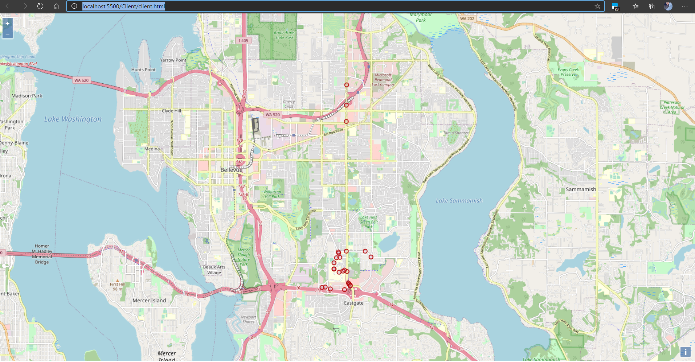

# Real-Time Serverless GeoSpatial Public Transportation GeoFencing Solution

<!-- 
Guidelines on README format: https://review.docs.microsoft.com/help/onboard/admin/samples/concepts/readme-template?branch=master

Guidance on onboarding samples to docs.microsoft.com/samples: https://review.docs.microsoft.com/help/onboard/admin/samples/process/onboarding?branch=master

Taxonomies for products and languages: https://review.docs.microsoft.com/new-hope/information-architecture/metadata/taxonomies?branch=master
-->


A fully working end-to-end solution, to never miss the bus again. Also, a funny way for learning how to create a serverless solution that leverages real-time public transportation geospatial data. The solution will also show how you can integrate Azure Functions with [IFTTT](https://ifttt.com/home) to get notification on your phone, so you'll be leaving home or office right on time.

## How it works

The sample uses an Azure Function to monitor Real-Time Public Transportation Data, available as [GTFS-Realtime Feed](https://gtfs.org/reference/realtime/v2/) and published by several public transportation companies like, for example, the [King County Metro](https://kingcounty.gov/depts/transportation/metro/travel-options/bus/app-center/developer-resources.aspx).

Every 15 seconds the Azure Function will wake up and get the GTFS Realtime Feed. It will send data to Azure SQL where, thanks to [Geospatial](https://docs.microsoft.com/en-us/sql/relational-databases/spatial/spatial-data-sql-server) support, data will be stored and processed to see if any of the monitored buses (in table `dbo.MonitoredRoutes`) is a Geofence (stored in `dbo.GeoFences` table). If yes, the function will call an IFTTT endpoint to send a notification to a mobile phone. Better leave the office to be sure not to miss the bus!

## Pre-Requisites

To run this sample, you need to have [Azure Function Core Tools 3.x](https://docs.microsoft.com/en-us/azure/azure-functions/functions-run-local?tabs=windows%2Ccsharp%2Cbash) or [Visual Studio Code](https://code.visualstudio.com/) or [Visual Studio 2019](https://visualstudio.microsoft.com/vs/) and an Azure SQL database to use. 

If you need help to create an Azure SQL database, take a look here: [Running the samples](https://github.com/yorek/azure-sql-db-samples#running-the-samples). 

If you are using Visual Studio Code, make also sure to have installed [Azure Storage Emulator](https://docs.microsoft.com/en-us/azure/storage/common/storage-use-emulator) and started it.

## Create Database and import Route static data

The GTFS Realtime feed will give you data with some values that needs to be decoded like, for example, the `RouteId`. In order to transform such Id into something meaningful, like the Route name (eg. 221 Education Hill - Crossroads - Eastgate).

You can download the static data zip file from here [King County Metro GTFS Feed Zip File](https://kingcounty.gov/depts/transportation/metro/travel-options/bus/app-center/developer-resources.aspx) and then you can import it into the `dbo.Routes` table using the Import capabilities of [SQL Server Management Studio](https://docs.microsoft.com/en-us/sql/relational-databases/import-export/import-flat-file-wizard), [Azure Data Studio](https://docs.microsoft.com/en-us/sql/azure-data-studio/extensions/sql-server-import-extension) or just using BULK LOAD as in script `./Database/01-import-csv.sql`

## Settings

Before running the sample locally or on Azure, make sure to create a `local.settings.json` file using the provided template. There are three settings that you must specify:

- `RealtimeFeedUrl` should point to a valid [GTFS-Realtime](https://gtfs.org/reference/realtime/v2/#message-feedheader) url. The sample uses the one provided by [King County Metro](https://kingcounty.gov/depts/transportation/metro/travel-options/bus/app-center/developer-resources.aspx). 

- `IFTTTUrl` should point to the url created by a IFTTT webhook. It something like `https://maker.ifttt.com/trigger/{event}/with/key/{key}`. You can get the correct url by accessing the Documentation section of the [Webhook page of IFTTT](https://ifttt.com/maker_webhooks).

- `AzureSQLConnectionString` is the connection string to the Azure SQL you want to use for running the sample

## Run sample locally

You can run and debug the sample locally, as local execution of Azure Function is fully supported by any of the aforementioned tools. Just run, after having started the Azure Storage Emulator

```bash
func start
```

You should see something like the following:


You can also use the sample website in `./Client` folder to see geospatial data. Using Visual Studio Code, use the [Live Server Extension](https://marketplace.visualstudio.com/items?itemName=ritwickdey.LiveServer) to open the `client.html` page:



## Deploy on Azure

The script `./azure-deploy.sh` will take care of everything. Make sure you set the correct values for you subscription for:

```
resourceGroup=
appName=
storageName=
location=
```

The script has been tested on Linux Ubuntu and the [Windows Subsystem for Linux](https://docs.microsoft.com/en-us/windows/wsl/) or the [Cloud Shell](https://shell.azure.com/).

The following resources will be created for you:

- Azure Functions with Consumption plan
- Azure Application Insights
- Azure Storage Account

The Azure SQL DB *will not* be created by the script.

## Using IFTTT

You need to have a free account on http://ifttt.com. Create an applet using:
- "Receive a Web Request" trigger, and name the event `bus_in_geofence`
- "Send a notification from the IFTTT app" event, with message `Bus {{Value1}} {{Value2}} GeoFence`

The method [TriggerIFTTT](https://github.com/Azure-Samples/azure-sql-db-serverless-geospatial/blob/main/BusDataManager.cs#L115) will issue POST HTTP request using the aforementioned information to call the IFTTT applet each time a bus enter or exit a GeoFence.


## Contributing

This project welcomes contributions and suggestions.  Most contributions require you to agree to a
Contributor License Agreement (CLA) declaring that you have the right to, and actually do, grant us
the rights to use your contribution. For details, visit https://cla.opensource.microsoft.com.

When you submit a pull request, a CLA bot will automatically determine whether you need to provide
a CLA and decorate the PR appropriately (e.g., status check, comment). Simply follow the instructions
provided by the bot. You will only need to do this once across all repos using our CLA.

This project has adopted the [Microsoft Open Source Code of Conduct](https://opensource.microsoft.com/codeofconduct/).
For more information see the [Code of Conduct FAQ](https://opensource.microsoft.com/codeofconduct/faq/) or
contact [opencode@microsoft.com](mailto:opencode@microsoft.com) with any additional questions or comments.
